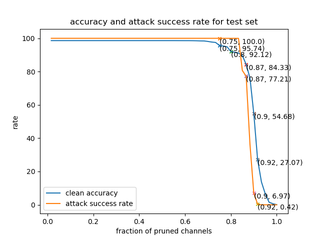

# Lab 3

```bash
├── architecture.py
├── data
│   ├── bd
│   │   ├── bd_test.h5
│   │   └── bd_valid.h5
│   ├── cl
│   │   ├── test.h5
│   │   └── valid.h5
│   └── data.txt
├── eval.py
├── lab3.py
├── model_B_10.h5
├── model_B_2.h5
├── model_B_4.h5
├── models
│   ├── bd_net.h5
│   └── bd_weights.h5
├── README.md
└── utils.py
```

## I. Dependencies
   1. Python 3.6.9
   2. Keras ~~2.3.1~~  2.4.3
   3. Numpy 1.16.3
   4. Matplotlib 2.2.2
   5. H5py 2.9.0
   6. TensorFlow-gpu ~~1.15.2~~ 2.4.1
   
## II. Data
   1. Download the validation and test datasets from [here](https://drive.google.com/drive/folders/1Rs68uH8Xqa4j6UxG53wzD0uyI8347dSq?usp=sharing) and store them under `data/` directory.
   2. The dataset contains images from YouTube Aligned Face Dataset. We retrieve 1283 individuals and split into validation and test datasets.
   3. bd_valid.h5 and bd_test.h5 contains validation and test images with sunglasses trigger respectively, that activates the backdoor for bd_net.h5. 

## III. Evaluating the Backdoored Model
   1. The DNN architecture used to train the face recognition model is the state-of-the-art DeepID network. 
   2. To evaluate the backdoored model, execute `eval.py` by running:  
      `python3 eval.py <clean validation data directory> <poisoned validation data directory> <model directory>`.
      
      E.g., `python3 eval.py data/cl/valid.h5 data/bd/bd_valid.h5 models/bd_net.h5`. This will output:
      Clean Classification accuracy: 98.64 %
      Attack Success Rate: 100 %

## IV. Repare the network and Evaluate

Run ```python3 lab3.py```.


1. Plot the accuracy on clean test data and the attack success rate:

Repaired networks B' model will be saved in ```model_B_{2, 4, 10}.h5```.



2. Evaluate the saved models:

Load the B and B' as a GoodNet G. Evaluate the performance.

| GoodNet_G_model | clean_test_acc | bad_attack_rate |
|-----------------|----------------|-----------------|
| **acc_drop_2%**     | 95.744349      | 100.000000      |
| **acc_drop_4%**     | 92.120031      | 99.984412       |
| **acc_drop_10%**    | 84.333593      | 77.209665       |
| **acc_drop_30%**   |  54.684334      |   6.968044      |

When pruning with validation set, it shows:

```
The clean accuracy is:  95.75647354291158
The attack success rate is:  100.0

The clean accuracy is:  92.10184463497012
The attack success rate is:  99.9913397419243

The clean accuracy is:  84.44617649605958
The attack success rate is:  77.015675067117

The clean accuracy is:  54.85407465142461
The attack success rate is:  6.968043647700702
```

As the result shows in the picture if we prune more channels, the attack success rate 
will drop (of course we can be aggressive: if pruning 92% channels, we almost defense all bad data but the accuracy will 
be also low). That is, the backdoor is disabled with some compromising of 
clean set accuracy.

When we are pruning the network, the accuracy of clean data drop before the dropping 
of attack success rate, which indicates the backdoors activated not only 
unused/spare neurons in the network. Therefore, it could probably be an Adaptive Attacker
whose attack method is prune aware attack.

## V. Important Notes
Please use only clean validation data (valid.h5) to design the pruning defense. And use test data (test.h5 and bd_test.h5) to evaluate the models. 
